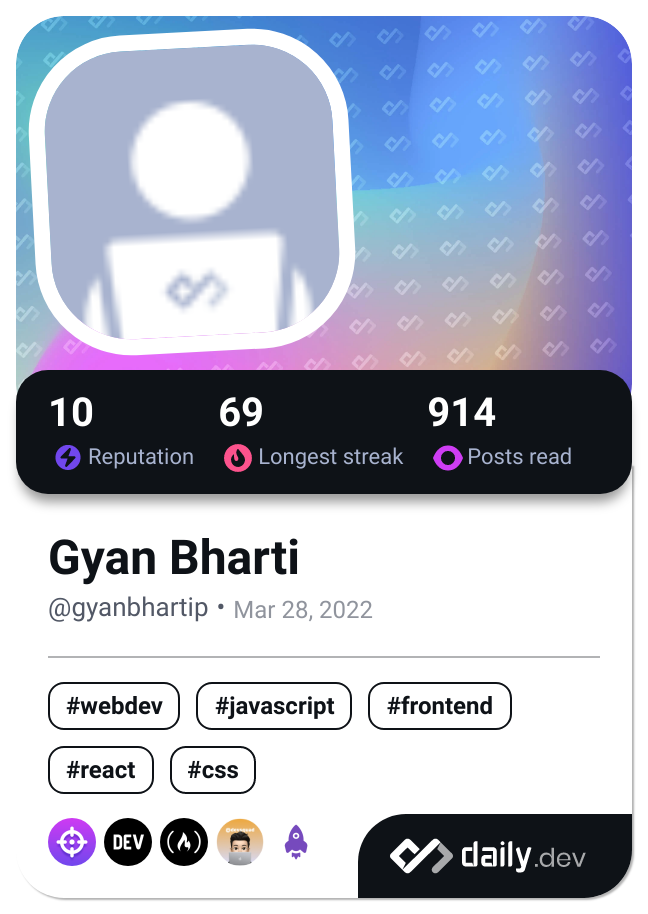

# 💫 About Me:
🔭 I’m currently working on React Native. 🌱 I’m currently learning NextJS. ⚡ Fun fact

## 🌐 Socials:
  

# 💻 Tech Stack:
                 	            
# 📊 GitHub Stats:
 
 

## 🏆 GitHub Trophies

### ✍️ Random Dev Quote

### 😂 Random Dev Meme

---

<!-- Proudly created with GPRM ( https://gprm.itsvg.in ) -->
